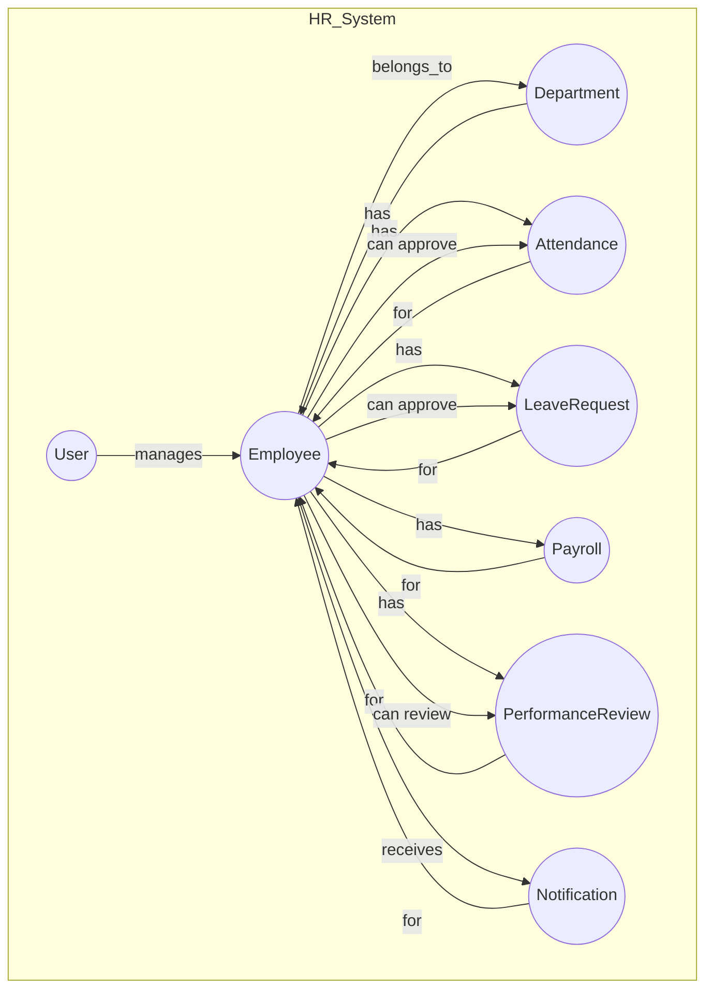

# HR System Architecture & Data Model

## 📄 Prisma Schema

```prisma
generator client {
  provider = "prisma-client-js"
}

datasource db {
  provider = "sqlite"
  url      = env("DATABASE_URL")
}

model User {
  id        Int     @id @default(autoincrement())
  name      String
  email     String  @unique
  // For authentication, you may want to add:
  // password String
  // role     String
  // Add more fields as needed for your auth system
}

model Department {
  id          Int      @id @default(autoincrement())
  name        String   @unique
  description String?
  managerId   Int?
  manager     Employee? @relation("DepartmentManager", fields: [managerId], references: [id])
  employees   Employee[]
}

model Employee {
  id                Int       @id @default(autoincrement())
  name              String
  email             String    @unique
  phone             String?
  position          String
  departmentId      Int
  department        Department @relation(fields: [departmentId], references: [id])
  location          String?
  startDate         DateTime
  status            EmployeeStatus @default(ACTIVE)
  avatar            String?
  dateOfBirth       DateTime?
  address           String?
  emergencyContact  String?
  employmentType    EmploymentType @default(FULL_TIME)
  salary            Float?
  lastLogin         DateTime?
  attendances       Attendance[]
  leaveRequests     LeaveRequest[]
  payrolls          Payroll[]
  performanceReviews PerformanceReview[]
  notifications     Notification[]
  qrSecret          String?
}

enum EmployeeStatus {
  ACTIVE
  ON_LEAVE
  INACTIVE
}

enum EmploymentType {
  FULL_TIME
  PART_TIME
  CONTRACTOR
}

model Attendance {
  id            Int      @id @default(autoincrement())
  employeeId    Int
  employee      Employee @relation(fields: [employeeId], references: [id])
  date          DateTime
  timeIn        String
  timeOut       String
  status        AttendanceStatus
  notes         String?
  location      String?
  approvedBy    Int?
  approver      Employee? @relation("AttendanceApprover", fields: [approvedBy], references: [id])
  overtimeHours Float?
  qrCheckIn     String?
  qrCheckOut    String?
  createdAt     DateTime @default(now())
  updatedAt     DateTime @updatedAt
}

enum AttendanceStatus {
  PRESENT
  ABSENT
  LATE
}

enum LeaveType {
  STUDY
  MATERNITY
  SICK
  OTHER
  VACATION
  ANNUAL
}

model LeaveRequest {
  id           Int      @id @default(autoincrement())
  employeeId   Int
  employee     Employee @relation(fields: [employeeId], references: [id])
  leaveType    LeaveType
  startDate    DateTime
  endDate      DateTime
  days         Int
  reason       String
  status       LeaveStatus @default(PENDING)
  appliedDate  DateTime  @default(now())
  approverId   Int?
  approver     Employee? @relation("LeaveApprover", fields: [approverId], references: [id])
  comments     String?
  attachmentUrl String?
}

enum LeaveStatus {
  PENDING
  APPROVED
  REJECTED
}

model Payroll {
  id            Int      @id @default(autoincrement())
  employeeId    Int
  employee      Employee @relation(fields: [employeeId], references: [id])
  periodStart   DateTime
  periodEnd     DateTime
  baseSalary    Float
  bonuses       Float?
  deductions    Float?
  taxes         Float?
  netPay        Float
  status        PayrollStatus @default(PENDING)
  processedDate DateTime?
  paymentMethod String?
  notes         String?
}

enum PayrollStatus {
  PENDING
  PROCESSED
  PAID
}

model PerformanceReview {
  id          Int      @id @default(autoincrement())
  employeeId  Int
  employee    Employee @relation(fields: [employeeId], references: [id])
  reviewerId  Int
  reviewer    Employee @relation("Reviewer", fields: [reviewerId], references: [id])
  periodStart DateTime
  periodEnd   DateTime
  score       Float
  rating      Float
  comments    String?
  status      ReviewStatus @default(IN_PROGRESS)
}

enum ReviewStatus {
  COMPLETED
  IN_PROGRESS
}

enum NotificationType {
  LEAVE_REQUEST
  REVIEW
}

model Notification {
  id        Int      @id @default(autoincrement())
  userId    Int
  user      Employee @relation(fields: [userId], references: [id])
  message   String
  type      String
  read      Boolean  @default(false)
  createdAt DateTime @default(now())
}
```

---

## 🗺️ System Entity Relationship Flowchart



---

## 🗂️ System Flow & Model Relationships

### 1. User & Authentication

- `User` is for authentication and admin/HR access (not regular employees).
- Employees are managed in the `Employee` model.

### 2. Departments

- Each `Department` can have a manager (`Employee`) and many employees.
- Employees reference their department via `departmentId`.

### 3. Employees

- Central entity for all HR data.
- Linked to: `Department`, `Attendance`, `LeaveRequest`, `Payroll`, `PerformanceReview`, `Notification`.
- Can have a QR secret for QR-based check-in/out.

### 4. Attendance

- Each record links to an `Employee`.
- Tracks daily check-in/out, status, QR data, overtime, and approval.
- Status is controlled by the `AttendanceStatus` enum.

### 5. Leave Requests

- Each request links to an `Employee` and optionally an approver.
- Leave type is controlled by the `LeaveType` enum (expand as needed).
- Tracks status, dates, reason, comments, and attachments.

### 6. Payroll

- Each payroll record links to an `Employee`.
- Tracks salary, bonuses, deductions, taxes, net pay, and payment status.

### 7. Performance Reviews

- Each review links to an `Employee` and a reviewer (also an employee).
- Tracks review period, score, rating, and comments.

### 8. Notifications

- Each notification links to an `Employee` (user).
- Type can be controlled by `NotificationType` (expand as needed).
- Used for system alerts (e.g., leave request updates, review reminders).

---

## 🏗️ Development Flow

1. **Authentication**

   - Use the `User` model for admin/HR logins.
   - Employees are managed separately (not for login unless you extend the model).

2. **Employee Management**

   - CRUD operations on `Employee`.
   - Assign to `Department`.
   - Set employment details, status, and QR secret.

3. **Attendance Tracking**

   - Employees check in/out (optionally via QR).
   - Create `Attendance` records with status, times, and notes.
   - Approvers can update/approve attendance if needed.

4. **Leave Management**

   - Employees submit `LeaveRequest` with type, dates, and reason.
   - Approvers (managers/HR) update status and add comments.
   - Attachments (e.g., medical notes) can be uploaded.

5. **Payroll**

   - HR/admin creates payroll records for each employee per period.
   - Calculate net pay from salary, bonuses, deductions, and taxes.
   - Update status as processed/paid.

6. **Performance Reviews**

   - Managers/HR create reviews for employees.
   - Track period, score, rating, and comments.
   - Status tracks if review is in progress or completed.

7. **Notifications**
   - System generates notifications for employees (e.g., leave status, review reminders).
   - Employees can mark notifications as read.

---

## 🧩 Integration Tips

- **Frontend:**

  - Use the enums in your API responses for dropdowns and status displays.
  - Always use IDs for relations (e.g., `employeeId`, `departmentId`).
  - For QR check-in/out, use the `qrSecret` and `qrCheckIn`/`qrCheckOut` fields.

- **Backend:**

  - Use Prisma’s relations for efficient querying (e.g., `include: { department: true }`).
  - Validate enum values on create/update.
  - Use default values for dates and statuses.

- **Extensibility:**
  - Add more leave types, notification types, or statuses as your business logic grows.
  - Add more fields to `User` if you want employees to log in.

---

## ✅ Ready for Development

- This schema is normalized, scalable, and matches the frontend’s needs.
- You can now run:
  ```sh
  npx prisma migrate dev
  npx prisma generate
  ```
- Start building your API endpoints and connect your frontend!

---

**If you need example API endpoints, seed scripts, or further architectural diagrams, just ask!**
